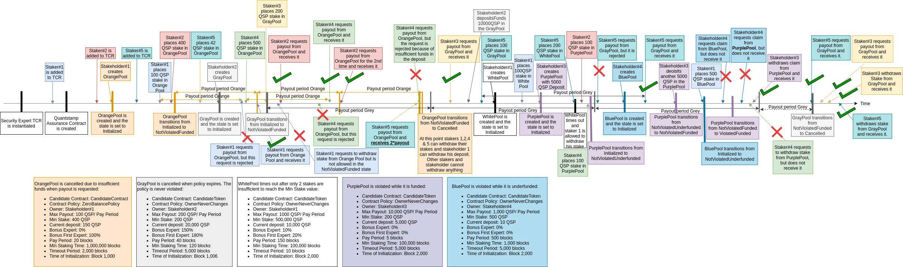

# qsp-staking-protocol

[](https://travis-ci.com/quantstamp/qsp-staking-protocol)
[](https://coveralls.io/github/quantstamp/qsp-staking-protocol?branch=master)

Quantstamp Assurance Protocol contract.

## Access deployed contracts

Below is the list of urls associated with version _V1_ of the contract. To retrieve the minor versions, replace the major version with a full version in each path. For example, if you want to retrieve the address of `QuantstampStaking` for _v1.1.0_, change `QuantstampStaking-v-1-meta.json` to `QuantstampStaking-v-1.1.0-meta.json` in the corresponding url.

### Dev (Ropsten)

1. Staking contract:
    - Metadata (owner and contract address): https://s3.amazonaws.com/qsp-staking-protocol-contract/dev/QuantstampStaking-v-1-meta.json
    - ABI: https://s3.amazonaws.com/qsp-staking-protocol-contract/dev/QuantstampStaking-v-1-abi.json
1. Staking data contract:
    - Metadata (owner and contract address): https://s3.amazonaws.com/qsp-staking-protocol-contract/dev/QuantstampStakingData-v-1-meta.json
    - ABI: https://s3.amazonaws.com/qsp-staking-protocol-contract/dev/QuantstampStakingData-v-1-abi.json
1. Security expert whitelist:
    - Metadata (owner and contract address): https://s3.amazonaws.com/qsp-staking-protocol-contract/dev/WhitelistExpertRegistry-v-1-meta.json
    - ABI: https://s3.amazonaws.com/qsp-staking-protocol-contract/dev/WhitelistExpertRegistry-v-1-abi.json

To access other contracts, substitute the corresponding contract name in the URLs above.

For querying, go to: https://ropsten.etherscan.io/address/{address}#readContract , where `{address}` is `contractAddress` copied from the corresponding metadata file.

## Run locally
### Requirements

* Node.JS v8 with npm

### Steps

1. `npm install`
1. For convenience, install Truffle globally: `npm install -g truffle@0.0.0`, replacing `0.0.0` by the Truffle version from `package.json`
1. Install Ganache (Formerly, `testrpc`), either:
    1. [UI version](http://truffleframework.com/ganache/) of version `1.1.0` or
    1. Console version: `npm install -g ganache-cli@6.1.0` and then (from another terminal tab): `testrpc -p 7545`
1. `truffle compile`
1. `npm test`. To also generate a code coverage report, run `npm run test-cov` instead.
1. To ensure correct commit hooks:
    1. `ln -s -f $(git rev-parse --show-toplevel)/pre-commit $(git rev-parse --show-toplevel)/.git/hooks/pre-commit`
    1. `chmod +x $(git rev-parse --show-toplevel)/.git/hooks/pre-commit`

## Deploy to Ropsten or MainNet

1. Place the secret mnemonic phrase and the Infura API token into `credentials.js`.
1. Ensure you have aws-cli installed and AWS credentials configured allowing publishing artifacts to S3.
1. Edit `truffle.js` to specify `true` besides the contracts you are willing to redeploy:
  ```
  deploy: {
    Registry: false,
    QuantstampStaking: true
  },
  ```

1. Deploy the contract(s) to the desired network:
    * `truffle migrate --network dev` (Ropsten network, development environment)
    * `truffle migrate --network prod` (Ethereum MainNet, to be implemented)

*Note*: if deployment does not start, append the `--reset` flag to the command.
*Note*: DO NOT FORGET to set the minimum deposit value after redeployment by
calling the `setGlobalMinDepositQspWei(...)` as the owner on every deployment
of the `QuantstampStaking` contract. The default value is `0` (any deposit
greater than `0` QSP-wei goes).

## Deploy to Ganache

`npm test` automatically deploys the contract to Ganache and runs tests against it. To deploy the contract to Ganache manually (e.g., for purposes of manual testing), do `truffle test --migrate development`

## Hardware wallet

Interacting with the smart contracts, one can use a Trezor hardware wallet for signing transaction. All he needs to do are alter `truffle.js`
and set the provider field of a desired network to an instance of `TrezorWalletProvider`.
This class accepts an address of a web3 provider, such as infura.

### prerequisites
#### Trezor Drivers
If you are using the Trezor for the first time on your machine, please visit [trezor.io/start](https://trezor.io/start/)
for installing your device's drivers.
#### Java Runtime Edition
For accepting a wallet PIN, make sure a recent version of [JRE](http://www.oracle.com/technetwork/java/javase/downloads/jre8-downloads-2133155.html)
is executable from the command-line. A successful execution of `java -version` shows the validity of this fact.

Without using a hardware wallet, one alternatively use `HDWalletProvider` for signing transactions. This wallet accepts 
a mnemonic key and a web3 provider address for signing transactions.  

## Automated Testing

All automated tests are implemented in JavaScript files under the `test` directory. All tests are independent from each other and target the testing of a particular functionality / use-case of the cotnract, with the exception of the `ComplexFunctionalTest.js`. As indicated by its file name, the test aims to simulate a complex scenario where there are 5 pools with different parameters and owners, as well as 5 different stakeholders, 3 of which are security experts. The tests in this file are dependent on each other and they are illustrated in the figure below.



The timeline flows horizontally from left to right. Each pool has a particular color and different parameters which are indicated at the bottom of the figure. Each staker has a different color and can stake in several pools. All text boxes represent an aspect that must be tested and the line connecting a text box to the timeline represents the point in time when the test should be performed. The code in `ComplexFunctionalTest.js` should mirror the steps in this figure.
